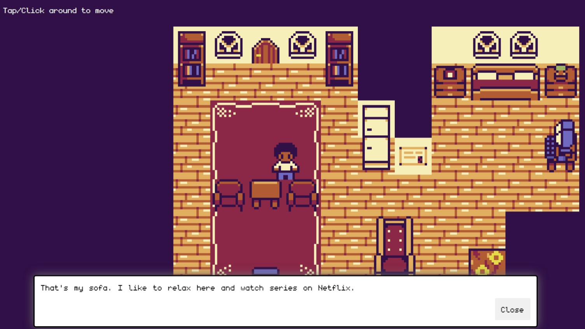

# 2D Portfolio

2D gamified portfolio coded using Kaboom.js library

 

## Tools & Resources

- [Kaboom.js](https://kaboomjs.com/) JavaScript game programming library
- [Tiled](https://www.mapeditor.org/) for drawing the map

## Installation

Clone the project.

```
git clone https://github.com/erkinozturk/2D_Portfolio.git
```

## Usage

After cloning the project, open it in Visual Studio Code.

for Linux:

```
cd 2D_Portfolio
code .
```
